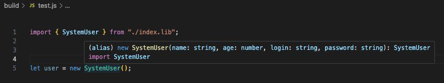

# Шпаргалка по Typescript

Конспект https://scriptdev.ru + то, что пришло в новых версиях языка.


Совместимость типов (механизм сопоставления типов) в Typescript осуществляется на основе структурной типизации. Структурная типизация считает типы совместимыми, если сопоставляемый тип имеет все признаки типа, с которым сопоставляется (т.е имеет те же ключи с идентичными (совместимыми) типами).

Различают также номинативную (основанную на наследовании и имплементации интерфейсов) и утиную (динамическую, которая, кстати, ничем не отличается от структурной) типизации.

A, B - предок. потомок

<>= - иерархия наследования

<b>Ковариантность</b> - позволяет использовать более конкретный тип, там, где изначально предполагалось использовать менее конкретный тип (больший тип справа). Совместимыми считаются типы A > B и A = B. Рекомендуется применять в местах, допускающих чтение и не рекомендуется в местах, допускающих запись.

<b>Контрвариантность</b> - механизм, обратный ковариантности. A < B и A = B (больший тип слева). Правила применения также обратны ковариантности.

<b>Инвариантность</b> - совместимыми считаются только идентичные типы A = B.

<b>Бивариантность</b> - допустимы все перечисленные виды вариантности (актуальна только для параметров функций). Считается самым нетипобезопасным видом.

Примитивные типы <b>(Number, String, Boolean и т.д.)</b>, указанные с большой буквы являются конструкторами и могут быть расширены и  имплементированы, но аннотировать ими в таком виде рекомендуется только если подразумевается именно конструктор (для остальных случаев с маленькой буквы).

<b>number</b> - 64-битные числа двойной точности с плавающей запятой.

<b>string</b> - последовательность символов в кодировке Unicode UTF-16.

<b>boolean</b> - true, false;

<b>symbol, unique symbol</b> - уникальные идентификаторы, которые могут использоваться как индексируемые члены объектов.

<b>bigint</b> - для работы с числами произвольной точности, в том числе со значениями, выходящими за пределы Number.

Указанные типы неявно преобразуются в типы-конструкторы (number -> Number), но не наоборот.

<b>null, never, undefined и any</b> - являются подтипами всех типов, поэтому совместимы со всеми остальными типами. При активном флаге --strictNullChecks null и undefined совместимы только с any.

Совместимость означает что тип может быть назначен другому типу:

```TypeScript
function a(): void {
    return 5; // Error
}

function b(): void {
    return undefined; // Ok
}
```

<b>unknown</b> - типобезопасный аналог any. Все типы совместимы с unknown, а он совместим только с собой и с any. Может использоваться только в операциях равенства и в операциях с логическими операторами &&, ||, !. Другие опреации с unknown не допускаются.

```TypeScript
let a: unknown;
let b: string = '';

a = b; // Ok
b = a; // Тип "unknown" не может быть назначен для типа "string"

let unknownObj: unknown = {
    a: 1
}

unknownObj.a // Error
```

Но не наоборот.

При пересечении unknown перекрывается всеми типами.

```TypeScript
type T = number & unknown // -> number
```

При объединении | наоборот - перекрывает все типы кроме any.

<b>enum</b> - перечисление, компилируется в объект javaScript, поскольку предоставляет реальные значения.

При использовании enum смешанного типа (когда есть автоматически нумерованная константа и константа с явно заданным значением) в качестве типа нужно быть внимательным, так как в таком случае функция, аргумент которой аннотирован таким enum, может быть вызвана с любым числовым аргументом.

При объявлении с const Enum не будет преобразован в объект, а использованное значение будет заменено литералом. Можно использовать для оптимизации, т.к. обращение к литеральному значению быстрее, чем через точечную нотацию.

```TypeScript
const enum SomeCount {
    count = 10
}
let someCount = SomeCount.count;
```

С помощью оператора typeof можно запросить тип из объекта за счет вывода типов.

```TypeScript
let objForType = { a: 1, b: 'value' }

let objFromType: typeof objForType; // для objFromType будет работать автодополнение

let numberVariable = 1;

let varFromNumberVar: typeof numberVariable = ''; // Error
```

Если отдельный модуль с типами содержит только типы, сборщики не будут включать его в сборку.

Литералы типа String не могут быть объявлены через обратные кавычки, но шаблонный литеральный тип может:

```TypeScript
type Sides = "top" | "right" | "bottom" | "left";

type PaddingSides = `padding-${Sides}`;
```

Также можно использовать операторы преобразования Uppercase, Lowercase, Capitalize и Uncapitalize:

```TypeScript
type A = Uppercase<"abcd">; // type A = "ABCD"
```

Поведение типа <b>object</b> и интерфейса <b>Object</b> различаются - для object нельзя назначить примитивные типы (number, string и т.д.), а для Object можно. Тип object соответствует чистому объекту и не содержит никаких признаков (даже унаследованных от типа Object). Проверил утверждение о наследовании - object не ругается на, например, hasOwnProperty, но автодополнение не работает в отличие от Object.

```TypeScript
let simpleObject: object = {};

let normalObject: Object = {};

simpleObject.hasOwnProperty('') // Ok но без автодополнения

normalObject.hasOwnProperty('') // Ok
```

<b>Tuple</b> - кортеж, описывает строгую последовательность множества типов, каждоый из которых описывает элемент массива с аналогичным индексом.

```TypeScript
let v0: [string, number] = ['Dambo', 1]; // Ok

/*
 * при присваивании значения нельзя добавить больше элементов,
 * но можно это сделать, если массив ассоциирован со ссылкой,
 * при этом тип добавляемого элемента должен соответствовать типам, установленным кортежем
 */
 v0.push('str') // Ok
 v0.push(true) // Error
```

Интересный вариант с назначением кортежа остаточным параметрам. При этом параметры могут быть указаны как необязательные для частичной передачи.

```TypeScript
function fn(...rest: [number, string?, boolean?]): void {}
```

Значениям элементов кортежа можно добавлять метки, что улучшает семантику кода, например, при аннотировании сигнатуры функции (метки исчезают после компиляции):

```TypeScript
function fn(...args: [name: string, count: number]) {}
```

Вывод типов не способен выводить тип Tuple.

<b>Function</b> - это тип функции, тип высшего порядка, а <b>() => type</b> это функциональный тип - подробное описание сигнатуры функции.

В случае использования функциональной примеси и проблемам с аннторированием this в этом случае - обратиться к документации:)

<b>Интерфейс</b> - контракт, реализация которого гарантирует наличие оговоренных в нем членов потребителю экземпляра. Интерфейс не может содержать реализацию. Класс может реализовывать неограниченное количество интерфейсов:

```TypeScript
class SomeClass implements I1, I2 {}
```

В интерфейсе нельзя декларировать get и set, однако тип поля будет совместим с акцессорами:

```TypeScript
interface IAnimal {
    id: string;
}

class Bird implements IAnimal {
    get id(): number { // Свойство "id" в типе "Bird" невозможно присвоить тому же свойству в базовом типе "IAnimal"
        return 1;
    }
}
```

Класс, унаследованный от класса, реализующего интерфейс, также наследует принадлежность к реализуемым им интерфейсам. В подобных сценариях говорят, что класс наследует интерфейс.

Интерфесы могут расширяться другими интерфейсами, а также могут расширять типы классов (при этом наследуется только описание членов класса, но не их реализация):

```TypeScript
class Animal {
    nickname: string;
    age: number;
}

interface IAnimal extends Animal {}
```

Интерфейс, полученный путем расширения типа класса, может быть реализован только самим этим классом или его потомками, поскольку помимо публичных (public) также наследует закрытые (private) и защищенные (protected) члены.

Инлайн-интерфейсы ничем не отличаются от именованных аналогов, кроме того, что их нельзя имплементировать и расширять (можно с помощью дженериков):

```TypeScript
let identifier: { p1: type; p2: type };

interface ISome extends { p1: type; p2: type } {
    // Error
}
```

Если интерфейс объявлен в одной области видимости с одноимённым классом, то компилятор считает, что класс реализовал этот интерфейс.

<b>Динамические ключи объектов</b> могут принадлежать к типам string и number, но их типы, указанные в аннотации типов, должны быть совместимы между собой:

```TypeScript
class SuperClass {
    a: number;
}

class SubClass extends SuperClass {
    b: number;
}

interface D {
    [key: string]: SuperClass; // Ok
    [key: number]: SubClass; // Ok, SubClass совместим с SuperClass
}

// это же справедливо и для методов
type T1 = {
    [x: string]: () => string
}

let a1: T1 = {
    a: () => 'value',
    b: 1 // Error
}
```

<b>Модификаторы:</b>

Все поля, для которых не указан модификатор по умолчанию считаются public.

Private - ограничивает доступ к полю контекстом класса (приватные поля не доступны в потомках).

Protected - доступны в контексте класса и в потомках.

Если класс состоит только из статических свойств и методов, как, например, класс Math, то его конструктор более разумно пометить как приватный и тем самым запретить создание его экземпляров. Класс с приватным конструктором нельзя расширить.

Существует сокращенный способ объявления полей класса за счет добавления модификаторов к полям в конструкторе (вместо объявления полей в теле класса):

```TypeScript
class SomeClass {
    constructor(
        public name: string,
        public age: number,
        private isAlive: boolean
    ) {}
}
```

<b>Абстрактные классы.</b>

Нельзя создать экземпляр абстрактного класса. Свойства и методы не могут иметь реализацию, но абстрактным полям может быть присвоено значние по умолчанию.

```TypeScript
abstract class Identifier {
    public abstract field: string = 'default value'; // реализация допустима
    public abstract get prop(): string; // реализация недопустима
    public abstract set prop(value: string); // реализация недопустима

    public abstract method(): void; // реализация недопустима
}
```

Обычные классы, расширяющие абстрактные классы, обязаны переопределить все поля, свойства и методы, находящиеся в иерархической цепочке и помеченные ключевым словом abstract.

Абстрактный класс, реализующий интерфейс, может не реализовывать его члены, а лишь пометить их как абстрактные, тем самым переложить реализацию на своих потомков.

Абстрактные классы могут содержать и обычные члены (например реализацию какого-либо метода), реализация которых не должна противоречить логике подклассов.

Интерфейсы предназначены для описания публичного api, которое служит для сопряжения с программой. Кроме того, они не могут реализовывать бизнес-логику. При проектировании программ упор должен делаться именно на интерфейсы. Абстрактные классы могут реализовывать интерфейсы в той же степени, что и обычные классы. Их нужно использовать в качестве базового типа тогда, когда множество логически связанных классов имеет общую для всех логику, использование которой в чистом виде не имеет смысла.

<b>Полиморфный тип this.</b>

Решает проблему, при которой метод, объявленный в суперклассе, возвращает значение, принадлежащее к типу самого суперкласса, который ничего не знает о методах, объявленных в его подтипах. Полиморфный тип this является множеством типов, определяемым цепочкой наследования, принадлежит к типу своего экземпляра и может быть определен только в момент создания экземпляра.

```TypeScript
class Animal {
    public sit(): this {
        return this;
    }
}

class Bird extends Animal {
    public fly(): this {
        return this;
    }
}

let bird = new Bird()
    .fly() // Ok
    .sit(); // Ok

bird = new Bird()
    .sit() // Ok, возвращает тип Bird
    .fly(); // Ok
```

<b>! - утверждение непринадлежности значения к undefined.</b>

Данный модификатор можно применять только тогда, когда доподлинно известно, что поле или переменная будет инициализирована каким-либо механизмом, выполняемым во время выполнения. В остальных случаях данный механизм лишь сведет на нет работу компилятора TypeScript.

<b>Дженерики.</b>

Обобщенное программирование (Generic Programming) — это подход, при котором алгоритмы могут одинаково работать с данными, принадлежащими к разным типам данных, без изменения декларации (описания типа).

Идентификаторы параметров типа принято выбирать из последовательности T, S, U, V и т.д. С помощью K и V принято обозначать типы, соответствующие Key/Value, а при помощи P — Property. Идентификатором Z принято обозначать полиморфный тип this.

Если параметры являются необязательными и значение не будет передано, то вывод типов определит принадлежность параметров типа к типу данных unknown.

```TypeScript
class Animal<T> {
    constructor(readonly id?: T) {}
}

let insect = new Animal(); // Ok -> insect: Animal<unknown>
```

Обобщенные типы, указанные в аннотации, у которых хотя бы один из аргументов типа является параметром типа, являются открытыми типами. А если все аргументы являются конкретными типами, то закрытыми.

```TypeScript
class T1<T> {
  public f: T0<number, T>; // T0 - открытый тип
}

class T2<T> {
  public f1: T0<number, string>; // T0 - закрытый тип
}
```

В случаях, когда обобщенный класс содержит обобщенный метод, параметры типа метода будут затенять параметры типа класса:

```TypeScript
type ReturnParam<T, U> = { a: T; b: U };

class GenericClass<T, U> {
    public defaultMethod<T>(a: T, b: U): ReturnParam<T, U> {
        return { a, b };
    }

    public genericMethod<T>(a: T, b: U): ReturnParam<T, U> {
        return { a, b };
    }
}

let generic: GenericClass<
    string,
    number
> = new GenericClass();

generic.genericMethod<boolean>(true, 0); // Ok
```

Параметры типов могут использоваться с ключевым сдовом extends. Параметр типа могут расширять как обычные типы, так и другие параметры типа (такое расширение назавают неприкрытым ограничением). Расширение используется, когда параметр типа должен обладать определенным набором свойств для решения конкретной задачи.

```TypeScript
class T1<T extends number> {}
class T2<T extends number, U extends T> {} // неприкрытое ограничение типа

interface IAnimal {
    name: string;
    age: number;
}

let animal: IAnimal;

class Bird<T extends typeof animal> {}
class Fish<K extends keyof IAnimal> {}
```

Для параметров типа может быть указано значение по умолчанию (при этом значение по умолчанию не ограничивает типа):

```TypeScript
class C1<T = string> {}
class C2<T extends T2 = T3> {}

// тип string устанавливается типу T в качестве типа по умолчанию...
class B<T = string> {
    constructor(value?: T) {
        if (value) {
        // ...что не оказывает никакого ограничения ни внутри...
        value.charAt(0); // Error -> тип T не имеет определение метода charAt
        }
    }
}

// ...ни снаружи
let b0 = new B(); // Ok -> let b0: B<string>
let b1 = new B(`ts`); // Ok -> let b1: B<string>
let b2 = new B(0); // Ok -> let b2: B<number>
```

<b>Дискриминантное объединение</b> является множеством типов, перечисленных через |. Во многом идентичен типу Union, но к дискриминантному объединению могут принадлежать только ссылочные типы данных, кроме того, каждому объектному тип, составляющему дискриминантное объединение, указывается идентификатор варианта - дискриминант.

Вывод типов способен работать только с общими для всех типов признаками:

```TypeScript
class Bird {
    fly(): void {}

    toString(): string {
        return 'bird';
    }
}

class Fish {
    swim(): void {}

    toString(): string {
        return 'fish';
    }
}

function move(animal: Bird | Fish): void {
    animal.fly(); // Error -> [*]
    animal.swim(); // Error -> [*]

    animal.toString(); // Ok
}
```

Для решения этой проблемы можно использовать сужение диапазона типов при помощи дискриминанта:

```TypeScript
class Bird {
    type: 'bird' = 'bird' // дискриминант

    fly(): void {}

    toString(): string {
        return 'bird';
    }
}

  class Fish {
    type: `is${string}` // дискриминант с шаблонной строкой

    swim(): void {}

    toString(): string {
        return 'fish';
    }
}

  function move(animal: Bird | Fish): void {
    if (animal.type === 'bird') {
        animal.fly(); // Ok
    } else if (animal.type === 'isFish') {
        animal.swim(); // Ok
    }

    animal.toString(); // Ok
}
```

Проверка выполняется при помощи механизма защитников типа.

Список литеральных типов, к которому может принадлежать дискриминант, состоит из Literal Number, Literal String, Template Literal String, Literal Boolean, Literal Enum.

<b>Импорт и экспорт только типа.</b>

В первую очередь предотвращает возможность использования конструкций в роли, отличной от обычного типа.

Во вторую - помогает оптимизировать конечную сборку. Теоретически, уточнение класса, используемого только в качестве типа, способно ускорить компиляцию, поскольку это избавляет компилятор от ненужных проверок на вовлечение его в логику работы модуля.

Опция компилятора verbatimModuleSyntax предупреждает, что нужно использовать import type, если импортируется именно тип.

```TypeScript
import { ITypeAsType } from "./types"; // 'ITypeAsType' is a type and must be imported using a type-only import when 'verbatimModuleSyntax' is enabled
import type { ITypeAsType } from "./types"; // Ok
```

<b>Утверждение типа.</b>

Угловые скобки в данном случае аналогичны оператору as. Типы, для которых выполняется утверждение, должны быть совместимы между собой.

```TypeScript
// <canvas id="stage" data-unactive="false"></canvas>

const element: Element = document.querySelector('#stage');

const stage: HTMLElement = <HTMLElement>element; // Ok
stage.dataset.unactive = 'true';
```

Приведение к константе:

```TypeScript
type Status = 200 | 404;
type Request = { status: Status };

let status = 200 as const;

let request: Request = { status };

// без as const status будет рассматриваться как number и не будет совместим с типом Request
```

Приведение массива к константе заставляет вывод типов определять его принадлежность к типу readonly tuple:

```TypeScript
let a = [200, 404] as const; // let b: readonly [200, 404]
```

В случае с объектным типом, утверждение к константе рекурсивно помечает все его поля как readonly. Кроме того, все его поля, принадлежащие к примитивным типам, расцениваются как литеральные типы.

```TypeScript
let a = { status: 200, data: { role: 'user' } } as const;

// компилятор видит как
let a: {
    readonly status: 200;
    readonly data: {
        readonly role: "user";
    };
}
```

Приведение к константе применимо исключительно к литералам таких типов, как number, string, boolean, array и object, а также только к простым выражениям.

```TypeScript
// не будет работать со ссылкой на идентификатор
let value = 'value';

let f = value as const; // Error

let a = (Math.round(Math.random() * 1)
    ? 'yes'
    : 'no') as const; // Ошибка
let b = Math.round(Math.random() * 1)
    ? ('yes' as const)
    : ('no' as const); // Ok, let b: "yes" | "no"
```

Утверждение в сигнатуре функции:

```TypeScript
function isStringAsserts(
    value: any
): asserts value is string {
    if (typeof value !== 'string') {
        throw new Error(``);
    }
}

const testScope = (text: any) => {
    text.touppercase(); // не является ошибкой, потому что тип - any

    isStringAsserts(text); // условие определено внутри утверждающей функции

    text.touppercase(); // теперь ошибка, потому что тип утвержден как string
};
```

<b>Защитники типа.</b>

Защитники типа работают внутри области, определяемой if или тернарным оператором.

Сужение диапазона типов возможно на основе доступных (public) членов, присущих типам, составляющим диапазон (Union):

```TypeScript
class A {
    public a: number = 10;
}
class B {
    public b: string = 'text';
}

function f0(p: A | B) {
    if ('a' in p) {
        return p.a; // p: A
    }

    return p.b; // p: B
}
```

Функции в роли пользовательских защитников типа может использоваться для улучшения семантики кода и соблюдения принципа DRY. Для таких функций вместо возвращаемого значения должен быть указан предикат identifier is <любой тип>. Внутри функции могут быть любые проверки, возвращающие true или false. Если значение не подходит ни по одному из признаков, возвращается never.

```TypeScript
function isString(arg: string | number): arg is string {
    return typeof arg === 'string';
}

function someAction(arg: string | number) {
    if (isString(arg)) {
        console.log(arg.toUpperCase())
    }
    console.log(arg.toUpperCase()) // Свойство "toUpperCase" не существует в типе "string | number".
}
```

<b>Вывод типов.</b>

Для полей readonly или констант в случае, когда значение принадлежит к примитивным типам number, string или boolean, вывод типов указывает принадлежность к литеральным примитивным типам, определяемым самим значением (в случае обычных переменных или полей, вывод типов определит тип как string, number и т.д.).

Для массива с разными типами будет выведен тип Union (равно как и при получении любого элемента массива):

```TypeScript
let v = [0, 'text', true]; // let v: (string | number | boolean)[]

let item = v[0]; // let item: string | number | boolean
```

Все объектные типы, составляющие объединение приводятся к одному виду:

```TypeScript
let v = [{ a: 5, b: 'text' }, { a: 6 }, { a: 7, b: true }];
// let v: ({ a: number, b: string } | { a: number, b?: undefined } | { a: number, b: boolean })[]
// отсутствующие свойства помечаются как необязательные

let a = v[0].a; // let a: number
let b = v[0].b; // let b: string | boolean | undefined
```

Если в качестве значений элементов массива выступают экземпляры классов, не связанных отношением наследования, то они и будут определять тип объединение. Если элементы массива являются экземплярами классов, связанных отношением наследования, то выводимый тип будет ограничен самым базовым типом.

Если типы содержат одноименное дискриминантное поле с разным значением, вывод типов вернет never из пересечения:

```TypeScript
type A = {
    type: 'a'; // дискриминантное поле
    a: number;
};
type B = {
    type: 'b'; // дискриминантное поле
    b: number;
};

type T = A & B; // never
```

Если убрать дискриминантные поля или назначить им один тип, вывод типов отработает как ожидается - type T = A & B; // A & B.

<b>Совместимость объектных типов.</b>

В случаях, когда один тип, помимо всех признаков второго типа, также имеет любые другие, то он будет совместим со вторым типом, но не наоборот. Для обратной совместимости потребуется операция явного преобразования (приведения) типов.

```TypeScript
class Bird {
    public name: string;
    public age: number;
}

class Fish {
    public name: string;
}

var bird: Bird = new Fish(); // Error
var bird: Bird = new Fish() as Bird; // Ok
let fish: Fish = new Bird(); // Ok
```

Типы, которые различаются только необязательными членами, также считаются совместимыми. Если в целевом типе все члены объявлены как необязательные, он будет совместим с любым типом, который частично описывает его, при этом тип источник может описывать любые другие члены. Помимо этого он будет совместим с типом, у которого описание отсутствует вовсе. Но он не будет совместим с типом, у которого описаны только отсутствующие в целевом типе члены. Такое поведение в TypeScript называется Weak Type Detection (обнаружение слабого типа). Типы, описание которых состоит только из необязательных членов, считаются слабыми типами.

Если в типе описан хоть один член с отличным от public модификатором доступа, он не будет совместим ни с одним схожим типом, независимо от того, какие модификаторы доступа применены к его описанию. Однако это не актуально, если типы связаны иерархией наследования.

Для объектных литератов есть особненность (корректируемая опцией компилятора suppressExcessPropertyErrors):

```TypeScript
interface IAnimal {
  name: string;
}

let equal = { name: '' };
let more = { name: '', age: 0 };
let less = {};

// объектный литерал должен полностью соответствовать типу
let v2: IAnimal = { name: '', age: 0 }; // Ошибка -> полей больше
let v3: IAnimal = {}; // Ошибка -> полей меньше

// если объект объявлен через переменную, то правила те же, что для классов
let v4: IAnimal = equal; // Ok -> одинаковые поля
let v5: IAnimal = more; // Ok -> полей больше
let v6: IAnimal = less; // Ошибка -> полей меньше
```

<b>Совместимость функциональных типов.</b>

Две сигнатуры считаются совместимыми, если они имеют равное количество параметров с совместимыми типами данных:

```TypeScript
type T1 = (p1: number, p2: string) => void;

let v1: T1 = (p3: number, p4: string) => {}; // Ok -> разные идентификаторы
let v2: T1 = (p1: number, p2: boolean) => {}; // Error
```

В случае, если перед остаточными параметрами объявлены обязательные параметры, то функция будет совместима с любой другой функцией, которая совместима с обязательной частью.

Сигнатура с меньшим числом параметров совместима с сигнатурой с большим числом параметров, но не наоборот.

Пример для метода forEach:

```TypeScript
forEach(callbackfn: (value: T, index: number, array: T[]) => void, thisArg?: any): void;
```

Если бы функциональный тип с большим числом параметров не был совместим с функциональным типом с меньшим числом параметров, то обязательно бы приходилось создавать callback со всеми тремя параметрами.

Параметры, принадлежащие к конкретным типам, совместимы с параметрами, которым в качестве типов указаны параметры типа, но не наоборот.

```TypeScript
function f0<T>(p: T): void {}
function f1(p: number): void {}

type T0 = typeof f0;
type T1 = typeof f1;

let v0: T0 = f1; // Error, параметр типа T не совместим с параметром типа number
let v1: T1 = f0; // Ok, параметр типа number совместим с параметром типа T
```

Типы параметров функций совместимы по правилам контрвариантности - т.е. в типе слева должно быть больше параметров. Установка опции компилятора strictFunctionTypes в false позволяет совмещать типы параметров по правилам бивариантности (слева может быть меньше параметров) без явного (as) приведения типов (см. Совместимость объектных типов).

Две сигнатуры считаются совместимыми, если их типы, указанные в аннотации возвращаемого значения, совместимы по правилам структурной типизации:

```TypeScript
class T0 {
    f0: number;
}

class T1 {
    f0: number;
    f1: string;
}

type FT0 = () => T0;
type FT1 = () => T1;

let v0: FT0 = () => new T1(); // Ok
let v1: FT1 = () => new T0(); // Error

// void в возвращаемом значении совместим со всеми типами
type T = () => void;
let v2: T = () => T1; // Ok
```

Две обобщенные функции считаются совместимыми, если у них в аннотации возвращаемого значения указан параметр типа. Параметр типа совместим с любым конкретным типом данных, но не наоборот:

```TypeScript
function f0<T>(p: T): T {
    return p;
}
function f1<S>(p: S): S {
    return p;
}

function f2(p: number): number {
    return p;
}

type T0 = typeof f0;
type T1 = typeof f1;
type T3 = typeof f2;

let v0: T0 = f1; // Ok
let v1: T1 = f2; // Error
let v2: T3 = f0; // Ok
```

<b>Совместимость объединений</b> работает противоположно объектной совместимости - больший тип слева, меньший - справа.

<b>Контекстный тип.</b>

В данном примере вместо show может быть любая строка, а аргумент event имеет тип any, мы же ожидаем, что будет доступен ограниченный перечень прослушиваемых событий, а тип event будет меняться в зависимости от события:

```TypeScript
class User {
    addListener(type: string, callback: Function) {}
}

let user = new User();

// вместо show может быть любая строка, а аргумент event имеет тип any
user.addListener('show', event => {})
```

Реализуем возможность использования контекстных типов:

```TypeScript
// добавляем литеральные типы для событий
type showEvent = 'show';
type changeEvent = 'change';

// добавляем классы для объекта event
class showEventObject {
    fromShowEvent() {}
}
class changeEventObject {
    fromChangeEvent() {}
}

// добавляем типы, описывающие сигнатуры коллбэка
type showEventCallback = (event: showEventObject) => void
type changeEventCallback = (event: changeEventObject) => void

// перегружаем функцию addListener
class User {
    addListener(type: showEvent, callback: showEventCallback): void;
    addListener(type: changeEvent, callback: changeEventCallback): void;
    addListener(type: string, callback: Function): void {}
}

let user = new User();

user.addListener('show', event => event.fromShowEvent()) // event: showEventObject
user.addListener('change', event => event.fromChangeEvent()) // event: changeEventObject
```

Оператор <b>keyof</b> выводит все публичные, нестатические, принадлежащие типу ключи и на их основе создает литеральный объединенный тип Union (или never, если публичных ключей нет).

Может использоваться в объявлении обобщенного типа данных:

```TypeScript
interface User {
    name: string
    age: number
}

function fn<T, U extends keyof T = keyof T>(arg1: T, arg2: U): void {}

let arg1: User = {
    name: 'User',
    age: 30
}

fn(arg1, 'name') // вторым аргументом можно передать только name или age
```

<b>Поиск типов</b> позволяет получить заданные типы по известным ключам:

```TypeScript
interface IInterfaceType {
    p1: number;
    p2: string;
}

let v1: IInterfaceType['p1']; // v1: number
let union: IInterfaceType['p1' | 'p2']; // union: number | string
```

<b>Сопоставление типов.</b>

```TypeScript
type ABC = 'a' | 'b' | 'c';

type ABCWithString = {
    [K in ABC]: string;
};

let abc: ABCWithString = {
    a: 'aaa',
    b: 'bbb',
    c: 'ccc'
} // в наличии должны быть все ключи из оъединения
```

В сочетании с запросом ключей, сопоставлением типов и дженериками:

```TypeScript
interface IUser {
    name: string,
    age: number
}

type MappedType<T> = {
    [K in keyof T]: T[K];
};

let mapped: MappedType<IUser> = {
    name: 'User',
    age: 30
}

type MappedTypeField<T, U extends keyof T> = {
    readonly [K in U]: T[K]; // можно добавить модификатор
};

let mappedField: MappedTypeField<IUser, 'name'> = {
    name: 'User'
}

mappedField.name = 'new User' // Не удается задать значение для "name", так как это свойство, доступное только для чтения
```

Переопределение исходных ключей:

```TypeScript
type ToGetter<T extends string> = `get${Capitalize<T>}`;

type Getters<T> = {
    [K in keyof T as ToGetter<K>]: () => T[K];
}

type Person = {
    name: string;
    age: string;
}

/**
 * type T = {
 *     getName: () => string;
 *     getAge: () => number;
 * }
 */
type T = Getters<Person>
```

Префиксы + и - реализуют поведение модификаторов readonly и ?:

```TypeScript
type AddModifier<T> = {
    +readonly [P in keyof T]+?: T[P]; // добавит модификаторы readonly и ? (optional)
};
type RemoveModoifier<T> = {
    -readonly [P in keyof T]-?: T[P]; // удалит модификаторы readonly и ? (optional)
};

interface IWithoutModifier {
    field: string;
}
interface IWithModifier {
    readonly field?: string;
}

let addingModifier: AddModifier<IWithoutModifier> = {
    field: '',
};

addingModifier.field = ''; // Error - свойство readonly

let removingModifier: RemoveModoifier<IWithModifier> = {}; // Error - отсутствует свойство
```

<b>Условные типы.</b>

```TypeScript
// если тип слева совместим с типом справа, то будет number
type T0<T, U> = T extends U ? number : string;

/* условия могут быть вложенными
 * type T0<T, U> = T extends U ? number : T extends string ? string : boolean;
 */

interface User {
    name: string
    age: number
}

interface SystemUser extends User {
    login: string
}

let userName: T0<User, SystemUser> = 'User' // Ok

let userId: T0<User, SystemUser> = 1 // Error

// для объединения проверка условия выполняется для каждого типа в объединении
let userIdName: T0<User | SystemUser, SystemUser> = 'User' // Ok
let userIdName: T0<User | SystemUser, SystemUser> = 1 // Ok
```

Ключевое слово <b>infer</b> позволяет определить переменную внутри ограничения, на которую можно ссылаться или возвращать:

```TypeScript
type TypeA = { id: string }
type TypeB = { id: number }

type InferType<T> = T extends { id: infer P } ? P extends string ? string : number : any

type ResultType1 = InferType<TypeA> // string
type ResultType2 = InferType<TypeB> // number
type ResultType3 = InferType<object> // any
```

<b>Readonly, Partial, Required, Pick, Record.</b>

Гомоморфные типы (за исключением Record). Гомоморфизм — это возможность изменять функционал, сохраняя первоначальные свойства всех операций.

Readonly\<T> добавляет каждому члену объекта модификатор readonly, делая их тем самым доступными только для чтения. Полезно применять к аргументам функций, делая их иммутабельными.

Partial\<T> добавляет членам объекта модификатор ?:, делая их таким образом необязательными.

Required\<T> удаляет все необязательные модификаторы ?:, приводя члены объекта к обязательным. Достигается это путем удаления необязательных модификаторов при помощи механизма префиксов - и +.

Pick\<T, K> предназначен для фильтрации объектного типа, ожидаемого в качестве первого параметра типа. Фильтрация происходит на основе ключей, представленных множеством литеральных строковых типов, ожидаемых в качестве второго параметра типа.

```TypeScript
interface IT {
    a: number;
    b: string;
    c: boolean;
}

type T0 = Pick<IT, 'a' | 'b'>;
```

Record\<K, T> предназначен для динамического определения полей в объектном типе.

```TypeScript
interface IConfigurationIndexSignature {
    payload: {
        [key: string]: string;
    };
}

// аналогично предыдущему варианту
interface IConfigurationWithRecord {
    payload: Record<string, string>;
}
```

В отличие от индексной сигнатуры типа Record\<K, T> может ограничить диапазон ключей:

```TypeScript
type WwwConfig = Record<'port' | 'domain', string>;

let wwwConfig: WwwConfig = {
    port: '80',
    domain: 'https://domain.com',

    user: 'User', // Error -> Object literal may only specify known properties, and 'user' does not exist in type 'Record<"port" | "domain", string>'.
};
```

<b>Exclude, Extract, NonNullable, ReturnType, InstanceType, Omit.</b>

Exclude\<T, U> будет представлять разницу типа T относительно типа U - из типа T будут исключены признаки (ключи), присущие также и типу U.

Extract\<T, U> будет представлять пересечение типа T относительно типа U - после разрешения Extract<T, U> будет принадлежать к типу определяемого признаками (ключами), присущими обоим типам.

NonNullable\<T> удаляет из аннотации типа такие типы, как null и undefined:

```TypeScript
let v0: NonNullable<string | number | undefined | null>; // let v2: string | number
```

ReturnType\<T> служит для установления возвращаемого из функции типа. В качестве параметра типа должен обязательно выступать функциональный тип.

```TypeScript
let v0: ReturnType<() => void>; // let v0: void
let v1: ReturnType<() => number | string>; // let v1: string|number
let v2: ReturnType<<T>() => T>; // let v2: {}
```

InstanceType\<T> предназначен для получения типа экземпляра на основе типа, представляющего класс.

Parameters\<T> предназначен для получения типов, указанных в аннотации параметров функции:

```TypeScript
function f<T>(
    p0: T,
    p1: number,
    p2: string,
    p3?: boolean,
    p4: object = {}
) {}

/**
 * type FunctionParams = [p0: unknown, p1: number, p2: string, p3?: boolean, p4?: object]
 */
type FunctionParams = Parameters<typeof f>;
```

ConstructorParameters\<T> предназначен для получения типов, указанных в аннотации параметров конструктора.

Omit\<T, K> предназначен для определения нового типа путем исключения заданных признаков из существующего типа:

```TypeScript
type Person = {
    firstName: string;
    lastName: string;
    age: number;
};

/**
 * type PersonName = {
 *    firstName: string;
 *    lastName: string;
 * }
 */
type PersonName = Omit<Person, 'age'>;
```

<b>Массивоподобный readoly тип.</b>

```TypeScript
let array: readonly string[] = ['Kent', 'Clark']; // Массив
let tuple: readonly [string, string] = ['Kent', 'Clark']; // Кортеж

type A = Readonly<number[]>; // аналогичный эффект
```

Элементы таких структур невозможно удалить или изменить (отсутствуют методы, предназначенные для изменения). вывод типов расценивает readonly массив как принадлежащий к интерфейсу ReadonlyArray\<T>.

```TypeScript
// эффект одинаковый
let array: readonly number[] = [0, 1, 2];
let array: ReadonlyArray<number> = [0, 1, 2];
```

ReadonlyMap\<K, V> и ReadonlySet\<T> не имеют методов, способных изменить соответствующие объекты.

<b>Операторы присваивания короткого замыкания.</b>

```TypeScript
a &&= b; // a && (a = b)
a ||= b; // a || (a = b);
a ??= b; // a !== null && a !== void 0 ? a : (a = b);
```

<b>Необязательные переменные при деструктуризации массивоподобных объектов</b> объявляются с префиксом _.

```TypeScript
let [_stop, play] = getPlayerControlAll();
```

<b>Декларации.</b> Позволяют объявлять типы для библиотек на JavaScript, например, когда билиотека состоит из скомпилированных из ts js-файлов, чтобы не терять типизацию.

Компилятор ищет в файле package.json свойство types и при его отсутствии или пустом значении “” переходит к поиску файла index.d.ts в корне директории. Если свойство types ссылается на конкретную декларацию, то точкой входа считается она.

Для библиотек с одной точкой входа создаем в корне index.lib.ts-файл и реэкспортируем в нем все необходимые для работы с библиотекой зависимости. Файл точки входа указываем в конфигурации tsconfig (примеры в данном репозитории). Для прод-конфигурации указываем опцию declaration: true, чтобы для каждого файла создавались соответствующие .d.ts-файлы, содержащие информацю о типах.

После сборки в .js-файлах импортированне функции и классы будут содержать информацию о типах, которые с ними ассоциированы.



Также файлы деклараций можно описывать вручную, с использованием declare module.

<b>Директива с тройным слешем.</b> Указывается в начале и предназначена для подключения деклараций, путь до которых указывается с помощью атрибута types.

```TypeScript
/// <reference types="react" />
```

<b>Что нового в ts начиная с версии 4.5.</b>

Новые ключевые слова и возможности языка, которые не были описаны выше, без погружения в детали изменений в работе компилятора.

<b>Тип Awaited.</b> Преназначен для моделирования операций await (или метода then()).

```TypeScript
type TA = Promise<Promise<number>>; // type Promise

type TB = Awaited<Promise<Promise<number>>>; // type number
```

<b>Один импорт для типа и для объекта js.</b> Импорт с type будет гарантированно удаляться при сборке:

```TypeScript
import { someFunc, type BaseType } from "./some-module.js";
```

<b>Передача функциям аргументов типа напрямую.</b>

Раньше, для того, чтобы сделать функцию более конкретной, для нее нужно було писать обертку, теперь можно объявить псевдоним для функции, заменив все дженерики в его сигнатуре:

```TypeScript
function makeBox<T>(value: T) {
    return { value };
}

// скомпилируется в const makeHammerBox = (makeBox);
const makeHammerBox = makeBox<number>;
const makeWrenchBox = makeBox<string>;

makeHammerBox(1) // Error
```

Эта логика также работает для функций-конструкторов, таких как Array, Map и Set.

<b>Дополнительные аннотации отклонений для параметров типа.</b>

Если мы хотим явно указать, что Getter ковариантно для T:

```TypeScript
type Getter<out T> = () => T;
```

Если Setter контрвариантно:

```TypeScript
type Setter<in T> = (value: T) => void;
```

И в комбинации:

```TypeScript
interface State<in out T> {
    get: () => T;
    set: (value: T) => void;
}
```

Вариация параметра типа зависит от того, используется ли он на выходе или на входе. Для чего: для улучшения семантики (ts подсветит ошибку, если для out указать входной параметр и наоборот), для оптимизации - явное объявление дисперсии позволяет компилятору опускать более глубокие проверки.

<b>satisfies</b> позволяет проверить, соответствует ли тип выражения некоторому типу, не меняя результирующий тип этого выражения:

```TypeScript
type Colors = "red" | "green" | "blue";
type RGB = [red: number, green: number, blue: number];
const palette = {
    red: [255, 0, 0],
    green: "#00ff00",
    bleu: [0, 0, 255]
//  ~~~~ The typo is now caught!
} satisfies Record<Colors, string | RGB>;
```

<b>Декораторы.</b>

```TypeScript
// context - объект контекста, содержит информацию о том, как был объявлен декорированный метод
function loggedMethod(originalMethod: any, context: ClassMethodDecoratorContext) {
    const methodName = String(context.name);
    function replacementMethod(this: any, ...args: any[]) {
        console.log(`LOG: Entering method '${methodName}'.`)
        const result = originalMethod.call(this, ...args);
        console.log(`LOG: Exiting method '${methodName}'.`)
        return result;
    }
    return replacementMethod;
}

class Person {
    name: string;
    constructor(name: string) {
        this.name = name;
    }
    // при target: ESNext компилируется как есть, при ES5 компилируется в полную жесть:)
    @loggedMethod
    greet() {
        console.log(`Hello, my name is ${this.name}.`);
    }
}
```

Если указано несколько декораторов, они будут выполняться в обратном порядке:

```TypeScript
@bound
@loggedMethod
greet() {
    console.log(`Hello, my name is ${this.name}.`);
}

// loggedMethod -> bound
```

Декорироваться могут не только методы, но и свойства, геттеры, сеттеры и сами классы.

[Подробная статья о декораторах](https://2ality.com/2022/10/javascript-decorators.html).

<b>const-модификатор.</b> Может использоваться вместо as const по-умолчанию, если из функции нужно получить более конкретный тип:

```TypeScript
function getNamesExactly<const T extends HasNames>(arg: T): T["names"] {
    return arg.names;
}
```

Ключевое слово <b>using</b>. Указываю для справки, темо очень большая и требует отдельного разбора. Похоже на менеджер конткеста with в python, который автоматически закрывает соединения, удаляет дескрипторы и т.д., когда в них больше нет необходимости.
